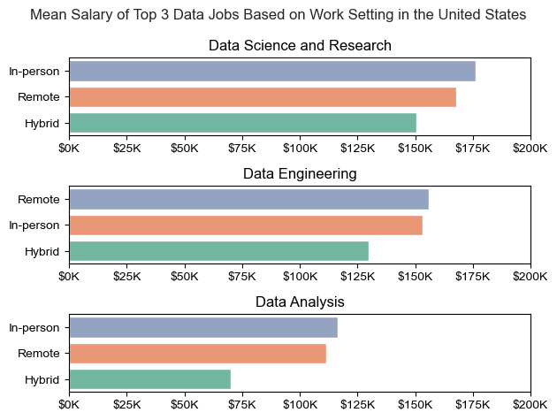

# Data Jobs Salary Analysis: Work Setting & Experience Level (US)

An exploratory analysis of how **work setting** (Remote, Hybrid, In-person) and **experience level** affect salaries across the three largest data job categories in the United States: **Data Science and Research**, **Data Engineering**, and **Data Analysis**.

The goal is to help job seekers break into the data field by showing what the market actually pays, and where flexibility or seniority changes that picture.



## Why This Project

According to the U.S. Bureau of Labor Statistics, data science employment is projected to grow **36% between 2023 and 2033**, with remote and hybrid work opening up many new positions. This project looks at the hiring and pay patterns behind that growth.

## Questions Explored

1. Does choosing flexibility (Remote or Hybrid) come with a salary trade-off?
2. Why does Hybrid show the lowest average pay in every category?
3. How do salaries grow with experience in each job category?
4. Do averages tell the whole story? (Salary distributions by experience level.)

## Key Findings

- **Hybrid roles have the lowest mean salary, but the likely reason is experience mix, not the setting itself.** Hybrid positions are heavily populated by junior-level roles, which pulls the average down.
- **Remote and In-person roles are anchored by Senior-level professionals**, and they pay more on average.
- **Data Engineering favors remote talent**, with Remote positions leading on mean salary.
- **Data Analysis has the lowest mean salary at every experience level, and the slowest salary growth** of the three categories.
- **Title levels overlap heavily.** In Data Analysis, Senior and Executive pay are nearly equal, and many Senior analysts out-earn Executives. In Data Science and Data Engineering, some Mid-level and Senior outliers out-earn the median of the level above them.
- **"Entry-level" in Data Science pays well compared with other fields.** Entry and Mid-level bands are compact, which suggests standardized pay scales.

> The full write-up, with charts and detailed commentary, is in [ANALYSIS.md](ANALYSIS.md). The step-by-step code is in [notebook.ipynb](notebook.ipynb).

## Dataset

- **Source:** [jobs_in_data on Kaggle](https://www.kaggle.com/datasets/hummaamqaasim/jobs-in-data/data)
- **Scope used:** companies located in the **United States** (8,132 rows, 12 columns, no missing values)
- **Top 3 job categories by volume (US):**

| Job category | Postings |
|---|---|
| Data Science and Research | 2,635 |
| Data Engineering | 1,977 |
| Data Analysis | 1,252 |

Main columns used: `job_category`, `work_setting`, `experience_level`, `salary_in_usd`, `company_location`.

## Methodology

1. Load the dataset and filter to `company_location == 'United States'`.
2. Identify the top 3 job categories with a frequency count on `job_category`.
3. Compute mean `salary_in_usd` with `groupby` by work setting and by experience level.
4. Break down experience level within each work setting (pie charts) to explain the Hybrid result.
5. Compare salary distributions per experience level (box plots) to check what the averages hide.

## Tech Stack

- **Python**
- **pandas** for data wrangling
- **matplotlib** and **seaborn** for visualization
- **Jupyter Notebook**

## Repository Structure

```
.
├── README.md              # Project overview (this file)
├── ANALYSIS.md            # Full written analysis with charts and insights
├── notebook.ipynb         # Step-by-step analysis notebook
├── jobs_in_data.csv       # Dataset (downloaded from Kaggle)
└── salary_analysis/
    └── images/            # Charts used in the write-up
```

## How to Run

1. Clone the repository:
   ```bash
   git clone https://github.com/<your-username>/<your-repo>.git
   cd <your-repo>
   ```
2. Install the dependencies (matplotlib 3.9 or newer is needed for the `tick_labels` argument used in the box plots):
   ```bash
   pip install pandas "matplotlib>=3.9" seaborn jupyter
   ```
3. Download `jobs_in_data.csv` from [Kaggle](https://www.kaggle.com/datasets/hummaamqaasim/jobs-in-data/data) and place it in the project root.
4. Open the notebook:
   ```bash
   jupyter notebook notebook.ipynb
   ```

## Limitations

- **Observational data.** The findings show associations, not causes. For example, the link between hybrid work and junior roles does not prove that companies use hybrid schedules for training.
- **Averages are sensitive to outliers.** The box plots are included for this reason, but group sizes (especially Executive-level) can be small.
- **US-only and one dataset.** Results may not generalize to other countries or to the wider market.
- **Salary figures depend on how the dataset was compiled.** Job titles and experience levels are as labeled in the source data.

## Author

**Rem-Josshua V. Roque**
BS Mathematics, Polytechnic University of the Philippines – Manila

- GitHub: [@Rem-Josshua](https://github.com/Rem-Josshua)
- LinkedIn: [@Rem-Josshua](https://www.linkedin.com/in/rem-josshua-roque-a422b5311)
- Email: remroque123@gmail.com
